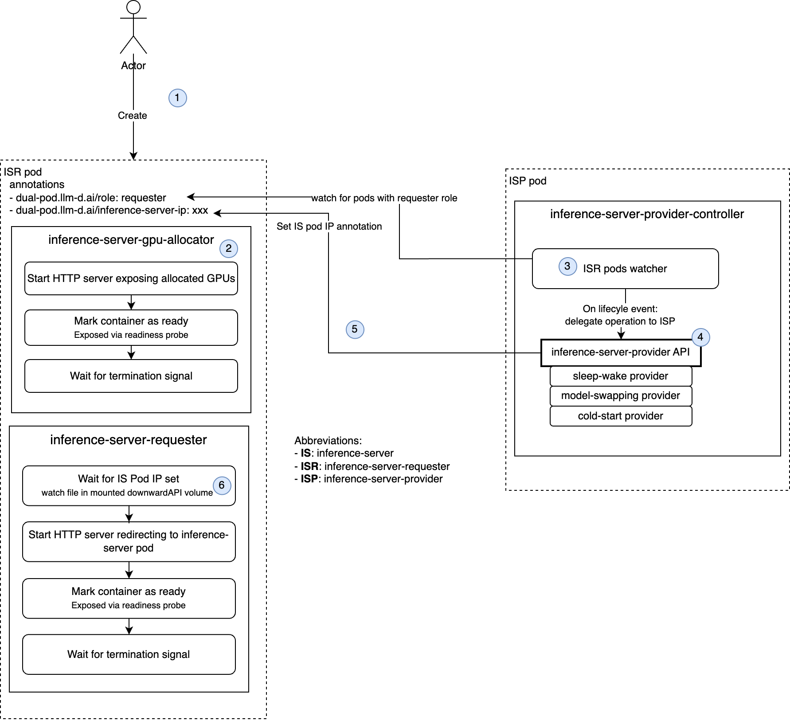

# Dual-Pod Architecture

## Overview

Dual pods is a technique for making model flexibility usable in the
Kubernetes milieu. Model flexibility refers to vLLM sleep/wake and
model swapping. These things do not fit simply and directly into
Kubernetes Pods because each container in a Pod: (1) is allocated a
constant amount of accelerator resources and (2) has a constant
command. Yet clients and users most naturally will use a single
Pod to describe a single desired inference server. The dual-pod
technique has a dichotomy between (1) the server-requesting Pods that
clients/users create and (2) the server-running Pods that actually run
the inference servers.

See [the user interface](../pkg/api/interface.go) and [the stub
interface](../pkt/stub/api/interface.go) for more details of the
technique.

When using vLLM as the inference server code, the server-requesting
Pod has a command conforming to the [`vllm serve`] CLI.
Various dual-pod controllers are possible.
The dual-pod controller that works with just the existing
sleep/wake functionality concludes that to create a server-running Pod
for a particular model, it uses the command `vllm serve <options>`.
The dual-pod controller
that works with the first edition (i.e., launcher based) of model
swapping uses a launcher-specific command to run the launcher. To swap
a model in, the controller issues a POST request (to the launcher)
that includes the model reference and the model-specific flags
according to a pattern fixed at controller development time. To swap a
model out, the controller issues a request that does not include the
model reference nor the model-specific flags.

## Example: vLLM and 1 nvidia GPU

Here is an example using vLLM and a model that runs on a single nvidia
GPU via the nvidia GPU operator. Details here are specific to nvidia
GPUs and software.

Following is what a client might submit to the kube-apiserver in a
request to create a server-requesting Pod.

```yaml
apiVersion: v1
kind: Pod
metadata:
  name: example-request
  annotations:
    dual-pod.llm-d.ai/admin-port: 8001
    dual-pod.llm-d.ai/server-patch: |
      spec:
        containers:
        - name: inference-server
          image: docker.io/vllm/vllm-openai@v0.10.1.1
          command:
          - vllm
          - serve
          - --port=8000
          - /pvcs/local/hf/models--deepseek-ai--DeepSeek-R1-Distill-Qwen-32B/snapshots/711ad2ea6aa40cfca18895e8aca02ab92df1a746
          - --max-model-len=32768
          env:
          - name: VLLM_CACHE_ROOT
            value: /pvcs/shared/vllm
          resources:
            limits:
              cpu: "2"
              memory: 1Gi
          volumeMounts:
          - name: local
            readOnly: true
            mountPath: /pvcs/local
        volumes:
        - name: local
          persistentVolumeClaim:
            claimName: {{ .LocalVolume }}
spec:
  affinity:
    nodeAffinity:
      requiredDuringSchedulingIgnoredDuringExecution:
        nodeSelectorTerms:
        - matchExpressions:
          - key: "nvidia.com/gpu.product"
            operator: In
            values: ["NVIDIA-A100-SXM4-80GB"]
  containers:
  - name: inference-server
    image: some-registry/some-namespace/stub@v0.1.0
    command:
    - /proxy
    - --relay-port-1=8000
    - --admin-port=8001
    - --metrics-port=8002
    - --debug-port=8003
    resources:
      limits:
        nvidia.com/gpu: "1"
        cpu: "1"
        memory: 250Mi
    volumeMounts:
    - name: shared
      mountPath: /pvcs/shared
  volumes:
  - name: shared
    persistentVolumeClaim:
      claimName: shared
```

From such a server-requesting Pod, after it is placed on the Node
named "somenode" and started and queried to reveal that the set of
associated GPUs is `{"3"}`, the dual-pod controller that manages
sleep/wake but not model swapping would construct the following to
give to the kube-apiserver to create the server-running Pod.

```yaml
apiVersion: v1
kind: Pod
metadata:
  name: somenode-8-dual
spec:
  affinity:
    nodeAffinity:
      requiredDuringSchedulingIgnoredDuringExecution:
        nodeSelectorTerms:
        - matchExpressions:
          - key: "kubernetes.io/hostname"
            operator: In
            values: ["somenode"]
  containers:
  - name: inference-server
    image: docker.io/vllm/vllm-openai@v0.10.1.1
    command:
    - vllm
    - serve
    - --port=8000
    - /pvcs/local/hf/models--deepseek-ai--DeepSeek-R1-Distill-Qwen-32B/snapshots/711ad2ea6aa40cfca18895e8aca02ab92df1a746
    - --max-model-len=32768
    env:
    - name: VLLM_CACHE_ROOT
      value: /pvcs/shared/vllm
    - name: CUDA_VISIBLE_DEVICES
      value: "3"
    resources:
      limits:
        nvidia.com/gpu: "0"
        cpu: "2"
        memory: 1Gi
    volumeMounts:
    - name: shared
      mountPath: /pvcs/shared
    - name: local
      readOnly: true
      mountPath: /pvcs/local
  volumes:
  - name: shared
    persistentVolumeClaim:
      claimName: shared
  - name: local
    persistentVolumeClaim:
      claimName: somenode-local
```

Explicitly specifying a quantity of "0" GPUs gets this container
access to all of the GPUs. Setting the `CUDA_VISIBLE_DEVICES` envar
directs the `vllm serve` process to use the indicated one.

The name of this Pod combines the name of the relevant node (which is
presumed to also appear as the value of the hostname label) and the
set of associated GPUs (hexadecimal rendering of bitmask).

## Sequence Flows

### Inference Server Creation Flow



The key steps for requesting an inference server are:

1. An actor (e.g., a Kubernetes controller or an end-user) creates an inference
   server requester pod (see example above).
2. The `inference-server-gpu-allocator` container exposes which accelerators have
   been allocated on the node and marks itself as ready (i.e., its readiness probe
   succeeds).
3. The `inference-server-provider-controller` container watches inference server
   requester pods (i.e., those with the annotation `dual-pod.llm-d.ai/role: requester`)
   and delegates lifecycle events (ie. `create`, `update` and `delete`) to
   the `inference-server-provider` component. Note: multiple implementations of
   the provider component may exists, but only one is active at any given time.
4. The `inference-server-provider` implementation selects an inference server that
   matches the inference server requester pod specification. If no suitable server pod is found,
   it falls back to the `cold-start provider`.
5. The `inference-server-provider` sets the `dual-pod.llm-d.ai/inference-server-ip`
   with the selected server pod's IP address.
6. The `inference-server-requester` containers periodically (TODO: rate?) reads
   the [file containing the `dual-pod.llm-d.ai/inference-server-ip` annotation value](https://kubernetes.io/docs/concepts/storage/volumes/#downwardapi) and when this value is
   not empty anymore, it optionally starts redirecting traffic to the selected
   inference server pod. It then mark itself as ready (i.e., its readiness probe
   succeeds).

### Inference Server Deletion Flow

TDB.

## Dual-pod controller logic

### Not even sleep/wake

This section is about the controller for the dual-pod technique.  This
is a first milestone that does not even use sleep/wake. There is a 1:1
correspondence between server-requesting Pod and server-running Pod.

The mutable internal state of the controller includes the following.

- The set of Nodes that this controller can use for server-running
  Pods. This is maintained by monitoring the taint that keeps other
  accelerator-using workloads off of these Nodes.

- For each relevant Node, the type of the accelerators (they are
  assumed to all be of the same type). This is maintained by looking
  at the Node label that conveys this information.

- A set of existing vLLM instances. Each runs a particular model, with
  other command line parameters and some environment variable
  settings. Each instance is in a Pod, on one Node, and uses a set of
  particular accelerators on that Node.

- A set of server-running Pods. Each is running one of the
  aforementioned vLLM instances.

- A set of server-requesting Pods that are bound to Nodes. Each such
  Pod specifies: model, other command-line parameters, some
  environment variable settings, and a Node. After its stub has been
  queried, this Pod is also known to specify a particular set of
  accelerators on the Node. This sever-requesting Pod may be bound
  (here, in this data structure) to a vLLM instance.

When, for a given server-requesting Pod, (a) the assigned set of
accelerators is not known and (b) the stub container is running
(without regard to whether the container is marked as "ready"), the
dual-pod controller tries until successful to query for the set of
assigned accelerators.

When there is a server-requesting Pod that has a known set of
accelerators but is not bound (in the controller's internal state) to
an existing vLLM instance, it is time to do something about
that. There is only one case: creating a new vLLM instance.

When making a new vLLM instance: the Kubernetes scheduler and kubelet
have already assured that there is no other server-requesting Pod
using any of those accelerators, and the behavior of this controller
means that consequently there is no vLLM instance using any of those
accelerators. The controller creates the new vLLM instance by creating
a new server-running Pod. This Pod uses the CUDA_VISIBLE_DEVICES
environment variable to convey the assigned set of accelerators. The
controller also sets up the relay of readiness from the vLLM instance
to the server-requesting Pod's inference-server container, as
mentioned below.

The relay of readiness goes as follows.

- The stub in the server-requesting pod can be sent an HTTP POST
  request that conveys the URL to poll for readiness of the real
  inference server container.

- Once given that URL, the stub aggressively polls it. Once a positive
  answer is returned, the stub itself responds positively to readiness
  requests on itself.

- After the dual-pod controller creates a server-running Pod, the
  controller waits for the IP address of the server-running Pod to be
  defined.

- Once the controller knows the IP address of the server-running Pod,
  the controller makes the POST request on the stub in the
  server-requesting Pod to convey the URL to poll.

### Sleep/wake only

This section is about the controller that manages sleep/wake only.

The mutable internal state of the controller includes the following.

- The set of Nodes that this controller can use for server-running
  Pods. This is maintained by monitoring the taint that keeps other
  accelerator-using workloads off of these Nodes.

- For each relevant Node, the type of the accelerators (they are
  assumed to all be of the same type). This is maintained by looking
  at the Node label that conveys this information.

- For each relevant Node, the set of accelerator IDs. This is
  accumulated from two sources: (1) responses to the query to stubs
  that returns the set of assigned accelerators, and (2) Prometheus
  time series that report on the current memory usage on an
  accelerator.

- For each accelerator on a relevant Node:

    - the total amount of accelerator memory currently in use, which
      comes (in the case of nvidia GPU operator) from monitoring the
      Prometheus metric named `DCGM_FI_DEV_FB_USED`;

    - the latest time when a vLLM instance using that accelerator went
      to sleep.

- A set of existing vLLM instances. Each is asleep or awake. Each runs
  a particular model, with other command line parameters and some
  environment variable settings. Each instance is in a Pod, on one Node, and
  uses a set of particular accelerators on that Node. Each sleeping
  vLLM instance has a timestamp indicating when it went to sleep.

- A set of server-running Pods. Each is running one of the
  aforementioned vLLM instances.

- A set of server-requesting Pods that are bound to Nodes. Each such
  Pod specifies: model, other command-line parameters, some
  environment variable settings, and a Node. After its stub has been
  queried, this Pod is also known to specify a particular set of
  accelerators on the Node. This sever-requesting Pod may be bound
  (here, in this data structure) to a vLLM instance.

When, for a given server-requesting Pod, (a) the assigned set of
accelerators is not known and (b) the stub container is running
(without regard to whether the container is marked as "ready"), the
dual-pod controller tries until successful to query for the set of
assigned accelerators.

When there is a server-requesting Pod that has a known set of
accelerators but is not bound (in the controller's internal state) to
an existing vLLM instance, it is time to do something about
that. There are two cases: waking a sleeping vLLM instance and
creating a new vLLM instance.

A sleeping vLLM instance is woken if there is one that is on the right
Node and has the same command line and environment variable settings
(which include one that identifies the assigned accelerators). The
controller makes the request to wake that instance, and upon positive
response makes the association in the controller's internal data
structure. The controller also completes the setup of the readiness
relay, as mentioned below.

Otherwise it is necessary to make a new vLLM instance (on that Node,
using the already-chosen set of accelerators). The Kubernetes
scheduler and kubelet have already assured that there is no other
server-requesting Pod using any of those accelerators, and the
behavior of this controller means that consequently there is no awake
vLLM instance using any of those accelerators. But the controller must
not bust the accelerator memory budget. The controller checks that on
each of the new vLLM instance's accelerators: the total amount of
accelerator memory in use does not exceed the budget for sleeping vLLM
instances. This check is done now (rather than when a vLLM instance is
put to sleep) so that this budget can be temporarily exceeded while
there are no awake instances using that accelerator. The controller
deletes sleeping vLLM instances that use the assigned accelerator(s)
if necessary to respect that budget; see details below. Once the
memory budget on each of the accelerators is respected, the new vLLM
instance is created. That is done by creating a new server-running
Pod.  This Pod uses the CUDA_VISIBLE_DEVICES environment variable to
convey the assigned set of accelerators.  The controller also sets up
the relay of readiness from the vLLM instance to the server-requesting
Pod's inference-server container.

The way that the memory budget is respected is as follows. If the
budget is exceeded on any accelerator _and_ the last sleep time for
that accelerator is older than a configured threshold (which is there
to account for the latency through Prometheus), a sleeping vLLM
instance using that accelerator is deleted; this is done by deleting
the server-running Pod of that vLLM instance.  The possibility of one
vLLM instance using multiple accelerators means that this decision is
not made independently for each accelerator. The controller chooses a
set of sleeping vLLM instances that covers the set of accelerators
that need a vLLM instance deletion. The choice is made with preference
for both (a) not deleting vLLM instances using accelerators that are
meeting their memory budget and (b) deleting less recently used vLLM
instances.

The relay of readiness goes as follows.

- The stub in the server-requesting pod can be sent an HTTP POST
  request that conveys the URL to poll for readiness of the real
  inference server container.

- Once given that URL, the stub aggressively polls it. Once a positive
  answer is returned, the stub itself responds positively to readiness
  requests on itself.

- After the dual-pod controller creates a server-running Pod, the
  controller waits for the IP address of the server-running Pod to be
  defined.

- Once the controller knows the IP address of the server-running Pod,
  the controller makes the POST request on the stub in the
  server-requesting Pod to convey the URL to poll.

- After waking a vLLM instance, the dual-pod controller makes the POST
  request to relay the server-running Pod's readinessProbe URL to the
  corresponding server-requesting Pod.

Note that this design is centered on vLLM instances rather than
server-running Pods. That makes it easy to adapt in the future when
one server-running Pod can have multiple vLLM instances (several
sleeping and maybe one awake).

### Model-swapping with sleep/wake

This manages the "Swap sleeping vLLM" mechanic, in which a launcher
can have multiple vLLM subprocesses (most sleeping, maybe one awake).

The mutable internal state of the controller includes the following.

- The set of Nodes that this controller can use for server-running
  Pods. This is maintained by monitoring the taint that keeps other
  accelerator-using workloads off of these Nodes.

- For each relevant Node, the type of the accelerators (they are
  assumed to all be of the same type). This is maintained by looking
  at the Node label that conveys this information.

- For each relevant Node, the set of accelerator IDs. This is
  accumulated from two sources: (1) responses to the query to stubs
  that returns the set of assigned accelerators, and (2) Prometheus
  time series that report on the current memory usage on an
  accelerator.

- For each accelerator on a relevant Node:

    - the total amount of accelerator memory currently in use, which
      comes (in the case of nvidia GPU operator) from monitoring the
      Prometheus metric named `DCGM_FI_DEV_FB_USED`;

    - the latest time when a vLLM instance using that accelerator went
      to sleep.

- A set of existing vLLM instances. Each is asleep or awake. Each runs
  a particular model, with other command line parameters and some
  environment variable settings. Each instance is in a Pod, on one
  Node, and uses a set of particular accelerators on that Node. Each
  has a unique ID. Each sleeping vLLM instance has a timestamp
  indicating when it went to sleep.

- A set of server-running Pods. One for each (relevant Node,
  accelerator on that Node). The controller maintains these Pods,
  creating and deleting as required by the previous statement. Each
  such Pod is running a subset of the aforementioned vLLM instances.

- A set of server-requesting Pods that are bound to Nodes. Each such
  Pod specifies: model, other command-line parameters, some
  environment variable settings, and a Node. After its stub has been
  queried, this Pod is also known to specify a particular set of
  accelerators on the Node. This sever-requesting Pod may be bound
  (here, in this data structure) to a vLLM instance.

When, for a given server-requesting Pod, (a) the assigned set of
accelerators is not known and (b) the stub container is running
(without regard to whether the container is marked as "ready"), the
dual-pod controller tries until successful to query for the set of
assigned accelerators.

When there is a server-requesting Pod that has a known set of
accelerators but is not bound (in the controller's internal state) to
an existing vLLM instance, it is time to do something about
that. There are two cases: waking a sleeping vLLM instance and
creating a new vLLM instance.

A sleeping vLLM instance is woken if there is one that is on the right
Node and has the same command line and environment variable settings
(which include one that identifies the assigned accelerators). The
controller makes the request to wake that instance, and upon positive
response makes the association in the controller's internal data
structure. The controller also completes the setup of the readiness
relay, as mentioned below.

Otherwise it is necessary to make a new vLLM instance (on that Node,
using the already-chosen set of accelerators). The Kubernetes
scheduler and kubelet have already assured that there is no other
server-requesting Pod using any of those accelerators, and the
behavior of this controller means that consequently there is no awake
vLLM instance using any of those accelerators. But the controller must
not bust the accelerator memory budget. The controller checks that on
each of the new vLLM instance's accelerators: the total amount of
accelerator memory in use does not exceed the budget for sleeping vLLM
instances. This check is done now (rather than when a vLLM instance is
put to sleep) so that this budget can be temporarily exceeded while
there are no awake instances using that accelerator. The controller
deletes sleeping vLLM instances that use the assigned accelerator(s)
if necessary to respect that budget; see details below. Once the
memory budget on each of the accelerators is respected, the new vLLM
instance is created. That is done by sending a launch request to the
server-running Pod associated with the lowest accelerator in the set,
and setting up the relay of readiness to the server-requesting Pod's
inference-server container as mentioned below.

The way that the memory budget is respected is as follows. If the
budget is exceeded on any accelerator _and_ the last sleep time for
that accelerator is older than a configured threshold (which is there
to account for the latency through Prometheus), a sleeping vLLM
instance using that accelerator is deleted; this is done by sending a
delete request to the Pod running that instance.  The possibility of
one vLLM instance using multiple accelerators means that this decision
is not made independently for each accelerator. The controller chooses
a set of sleeping vLLM instances that covers the set of accelerators
that need a vLLM instance deletion. The choice is made with preference
for both (a) not deleting vLLM instances using accelerators that are
meeting their memory budget and (b) deleting less recently used vLLM
instances.

The relay of readiness goes as follows.

- The stub in the server-requesting pod can be sent an HTTP POST
  request that conveys the URL to poll for readiness of the real
  inference server container.

- Once given that URL, the stub aggressively polls it. Once a positive
  answer is returned, the stub itself responds positively to readiness
  requests on itself.

- After the dual-pod controller makes a successful request to launch a
  new vLLM, the controller makes the POST request to the stub in the
  server-requesting Pod to relay the URL to poll.

- After waking a vLLM instance, the dual-pod controller makes the POST
  request to relay the server-running Pod's readinessProbe URL to the
  corresponding server-requesting Pod.

**NOTE**: the delta from the sleep/wake only technique is fairly
  small. The only changes from sleep/wake-only to model swapping plus
  sleep/wake are as follows.

- Recognizing that a vLLM instance has an ID.

- The addition of logic to maintain a server-running Pod per
  accelerator.

- No more creating a server-running Pod when a new vLLM instance is
  needed. Send a launch request instead. The readiness relay is
  correspondingly simplified.

- No more deleting a server-running Pod in order to delete a vLLM
  instance; send a delete request instead.
